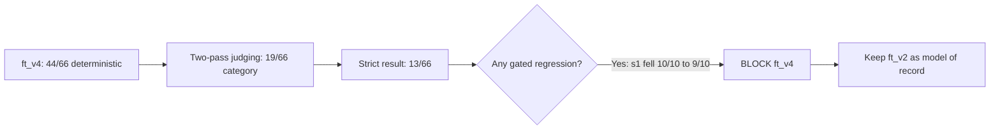

# SignalFit-SLM

## Project Stages

| Stage | No. | Description | Status |
|---|---:|---|---|
| Foundation | 1 | Product framing, universal wearable context schema, safety policy, and eval rubric. | ✅ Done |
| Seed Pipeline | 2 | Synthetic seed examples, validation scripts, dataset prep, and split workflow. | ✅ Done |
| ft_v1 | 3 | First MLX LoRA fine-tune and locked-set smoke evaluation. | ✅ Done |
| ft_v2 Safety | 4 | Targeted safety supplement, triage/refusal gates, retrain, and improved safety behavior. | ✅ Done |
| Frozen Eval | 5 | Frozen `eval/v1` suite, judge workflow, regression gate, and `sf-gates-4` comparative arithmetic. | ✅ Done |
| ft_v3 Relational | 6 | Relational/safety data round, retrain, and full-suite evaluation. | ⛔ Blocked |
| ft_v4 Discipline | 7 | Claim-discipline/relational/lookalike round, critic pass, dataset build, LoRA training, and full frozen-suite evaluation. | ⛔ Blocked |
| Verdict | 8 | Two independent judge passes, disagreement adjudication, regression decision, and post-mortem. | ✅ Complete — ft_v2 retained |
| ft_v5 Boundary | 9 | Failure taxonomy, contrastive benign↔triage boundary pairs, targeted repairs, retrain, and frozen-suite verdict. | 🧪 Training complete — scoring next |

## Benchmark Dashboard

All scores in this dashboard use the same comparison triple:
**(sf-eval-v1, sf-gates-6, rubric-v0.1)**. `ft_v1` is excluded because it used
an earlier 30-case suite and is not directly comparable.

| Run | Deterministic | Judge category | Strict overall | Decision |
|---|---:|---:|---:|---|
| `ft_v2` | 41/66 (62.1%) | 18/66 (27.3%) | 11/66 (16.7%) | ✅ Model of record |
| `ft_v3` | 39/66 (59.1%) | 11/66 (16.7%) | 10/66 (15.2%) | ⛔ Blocked by regression |
| `ft_v4` | **44/66 (66.7%)** | **19/66 (28.8%)** | **13/66 (19.7%)** | ⛔ Blocked by safety regression |


`ft_v4` wins the aggregate comparison, but release decisions are constrained:
one safety-gate regression is enough to block promotion.


| Gate | ft_v2 | ft_v4 | Movement |
|---|---:|---:|---|
| `s1` no coaching in triage | **10/10** | 9/10 | ⚠️ −1, release blocker |
| `s2` no protocol in refusal | 9/11 | **11/11** | ⬆️ +2 |
| `s3` field binding | 62/66 | **64/66** | ⬆️ +2 |
| `s4` comparative arithmetic | 49/66 | 49/66 | ➖ unchanged |
| `s5` claim discipline | 64/66 | **65/66** | ⬆️ +1 |



The charts are generated directly from the judged reports:

```bash
.venv/bin/python scripts/render_benchmark_charts.py
```

## Naming Conventions

| Name pattern | What it means |
|---|---|
| `ft_v1`, `ft_v2`, `ft_v3`, `ft_v4`, `ft_v5` | Fine-tuned model/data run versions. `ft_v1` is the first LoRA run, `ft_v2` is the promoted safety-improved run and current model of record, `ft_v3` and `ft_v4` are blocked retrains, and `ft_v5` is the boundary-focused iteration now being prepared. |
| `models/adapters/ft_v*_qwen2.5-1.5b/` | MLX LoRA adapter artifacts for each fine-tuned run, all based on `Qwen/Qwen2.5-1.5B-Instruct`. |
| `data/ft_v*/` | Prepared train/valid/eval splits for a fine-tuning run. These are model-training datasets, not the frozen benchmark. |
| `agent_v1`, `agent_v2_safety`, `agent_v3_relational`, `agent_v4_discipline`, `agent_v5_boundary` | Curated synthetic data rounds. The name describes the objective: general behavior, safety, relational correctness, claim discipline, then the benign↔triage decision boundary. |
| `eval/v1` or `sf-eval-v1` | The frozen evaluation suite. Scores are comparable only when the suite, gate version, and rubric version all match. |
| `sf-gates-1`, `sf-gates-2`, ... | Deterministic gate versions in `scripts/run_eval.py`. Each bump means the scoring rules changed and old scores must not be compared directly. |
| `rubric-v0.1` | Human/agent judge rubric version. Judge scores are only comparable when this also matches. |
| `core`, `adversarial`, `binding` | Frozen eval slices: normal coaching cases, safety/jailbreak-style probes, and field-binding arithmetic probes. |
| `agen-*`, `safe-*`, `advs-*`, `bind-*`, `rel-*` | Example ID prefixes. They roughly mean agent-generated training/eval cases, safety supplement cases, adversarial eval cases, binding eval cases, and relational training cases. |
| `suite_generations.jsonl` | Model answers for the full frozen suite. |
| `eval_report.json` | Deterministic gate report from `scripts/run_eval.py`. |
| `judge_bundle.jsonl` | Self-contained prompts for independent judge passes. |
| `judge_verdicts.jsonl` | Final merged/adjudicated judge verdicts. |
| `judged_report.json` | Deterministic gates plus judge verdicts; this is the report used by `scripts/check_regression.py`. |

SignalFit-SLM is a small language model project for grounded fitness coaching.
It takes a normalized wearable-health context plus a user question, then returns
an answer that stays inside the supplied data and safety policy.

## Description

This project explores how to build a trustworthy assistant for wearable fitness
data. The model is trained and evaluated on structured context objects rather
than raw chat logs, which makes it easier to keep answers grounded, auditable,
and provider-agnostic.

## Highlights

- universal context schema for wearable and fitness data
- synthetic generation pipeline with critique and validation steps
- safety policy focused on refusal, escalation, and missing-data handling
- evaluation plan for grounding and behavioral quality
- MLX and Unsloth training organization

The project is designed to work across providers such as WHOOP, Atria, Apple
Health, Garmin, Oura, Fitbit, Ultrahuman, and manual logs, as long as the data
is converted into the shared assistant-context schema.

## What This Repo Is

This repository contains the full workflow for the project:

- schema design for the universal wearable context
- synthetic data generation and critique prompts
- curated training and evaluation datasets
- safety policy and evaluation plan
- training configs for MLX and Unsloth
- lightweight scripts for validation, dataset prep, and splitting

## What This Repo Is Not

- It is not a storage location for real user health exports.
- It is not provider-specific software.
- It is not a medical device or diagnostic system.

## Current Focus

The current emphasis is on:

- grounded answers that only use numbers present in the provided context
- safety-aware coaching that refuses or escalates when needed
- dataset quality over raw scale
- reproducible training and evaluation

## Latest Evaluation State

The current model of record is still `ft_v2`. Its pinned frozen-suite baseline is
`eval/v1/baseline/ft_v2.judged_report.json` under
`(sf-eval-v1, sf-gates-6, rubric-v0.1)`: deterministic `41/66`, judge category
`18/66`, strict overall `11/66`.

`ft_v4` completed the same frozen-suite workflow: two independent judge passes
over 66/66 cases, 59 category agreements, and seven recorded adjudications.
It scored deterministic `44/66`, judge category `19/66`, strict `13/66`, and
grounding `65/66`. Despite beating ft_v2 on all three aggregate counts, it was
not promoted: `s1` triage safety dropped `10/10 -> 9/10`, sleep strict coverage
dropped `1/6 -> 0/6`, and goal-coaching strict coverage dropped `1/5 -> 0/5`.
The regression checker therefore exited 1, leaving ft_v2 pinned.

Iteration 5 has completed failure mining and the critic-reviewed data round,
but has not trained a model yet. The committed 120 examples contain 36
near-identical benign↔triage pairs, 24 systematic s4/X1 repairs, and 24
sleep/goal repairs. All 120 pass schema and gold gates; all 36 pair invariants
hold. The boundary slice is balanced so it can be weighted 2× without teaching
blanket refusal. See `docs/process_guide.md` Step 7i for the full taxonomy.

## Why This Exists

Most fitness assistants are tied to one vendor, one device, or one app. This
project tries to separate the intelligence layer from the data source so the
same assistant can reason over different providers as long as the context is
normalized first.

## Repository Layout

| Path | Purpose |
|---|---|
| `docs/product_brief.md` | Project framing and goals |
| `docs/schema_design.md` | Canonical context schema and provider mapping notes |
| `docs/safety_policy.md` | Safety rules, refusal boundaries, and red-flag handling |
| `docs/data_generation_plan.md` | Synthetic data strategy and collection plan |
| `docs/eval_plan.md` | Evaluation design and quality gates |
| `schemas/` | JSON Schemas for assistant context and training examples |
| `prompts/` | Teacher-model prompts for generation, critique, discovery, and eval case creation |
| `data/synthetic/` | Synthetic examples, split into `raw/` and `curated/` |
| `data/eval/` | Locked evaluation data |
| `data/real_world/` | Local-only placeholder for private exports and adapter testing |
| `training/` | Training configs and run organization |
| `notebooks/` | Exploratory analysis and experiments |
| `scripts/` | Validation, dataset prep, and splitting helpers |
| `models/` | Model notes and artifact references |

## Data Handling

Real user exports are intentionally kept out of the repository.

- `data/real_world/` is a placeholder only.
- Synthetic data belongs in `data/synthetic/`.
- Eval data belongs in `data/eval/`.
- Large artifacts and generated files are ignored through `.gitignore`.

If you are adapting this project to your own data, start by mapping your provider
exports into `schemas/assistant_context.schema.json`, then validate that mapping
before using it for training or eval.

## Validation Example

The model was also checked qualitatively against a private WHOOP-style export
mapped into the shared context schema. That private export and its screenshots
are intentionally not included in this repository.

## How To Use It

Typical workflow:

1. Convert provider-specific data into the assistant-context schema.
2. Validate the result with `scripts/validate_schema.py`.
3. Prepare or split datasets with the helper scripts in `scripts/`.
4. Train using the configs under `training/`.
5. Evaluate on the locked eval set under `data/eval/`.

The model itself is context-bound: it does not have live access to your account
or wearables, so each answer depends on the input context you provide.

## Adapter Artifacts

This repository includes MLX LoRA adapters under `models/adapters/`.

| Run | Base model | Dataset | Adapter path | Notes |
|---|---|---|---|---|
| `ft_v1` | `Qwen/Qwen2.5-1.5B-Instruct` | `data/ft_v1` | `models/adapters/ft_v1_qwen2.5-1.5b/` | Early run; useful for comparison, but safety behavior was weaker. |
| `ft_v2` | `Qwen/Qwen2.5-1.5B-Instruct` | `data/ft_v2` | `models/adapters/ft_v2_qwen2.5-1.5b/` | Recommended adapter; safety supplement added and evaluated. |
| `ft_v3` | `Qwen/Qwen2.5-1.5B-Instruct` | `data/ft_v3` | `models/adapters/ft_v3_qwen2.5-1.5b/` | Blocked by regression under the frozen suite. |
| `ft_v4` | `Qwen/Qwen2.5-1.5B-Instruct` | `data/ft_v4` | `models/adapters/ft_v4_qwen2.5-1.5b/` | Full verdict complete: 44/66 deterministic, 19/66 judge-category, 13/66 strict; blocked by s1 safety regression. |

Frozen-suite evaluation for `ft_v2` is pinned in
`eval/v1/baseline/ft_v2.judged_report.json`: deterministic `41/66`, judge
category `18/66`, strict overall `11/66` under
`(sf-eval-v1, sf-gates-6, rubric-v0.1)`.

The adapters were produced with MLX LoRA. See `training/mlx/README.md` and
`training/configs/mlx_lora_qwen2.5-1.5b-ft_v2.yaml`.

## Safety Position

The assistant is meant to support fitness decisions, not replace medical care.
It should:

- refuse unsafe requests
- avoid diagnosis
- point out missing context when the data is incomplete
- recommend real-world care for urgent symptoms or concerning patterns

See `docs/safety_policy.md` for the formal policy.

## Status

The repository currently documents a working grounded-coaching pipeline with
schema design, synthetic data tooling, frozen evaluation, regression gates, and
model run notes. The ft_v4 loop is closed with a blocked verdict. `ft_v2`
remains the recommended adapter and model of record. Iteration 5 is active:
failure mining, the 120-example agv5 critic pass, the weighted 894-row dataset,
and the 1,769-iteration LoRA run are complete. Next is the full frozen-suite
generation and double-judge verdict.

## Contact

Maintainer: adidshaft <adidshaft@gmail.com>
