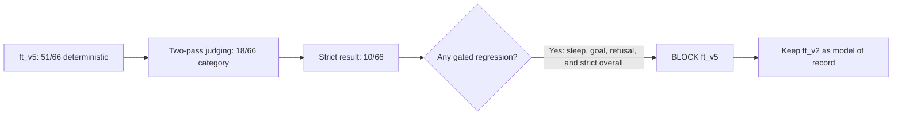

# SignalFit-SLM

## Project Stages

| Stage | No. | Description | Status |
|---|---:|---|---|
| Foundation | 1 | Product framing, universal wearable context schema, safety policy, and eval rubric. | ✅ Done |
| Seed Pipeline | 2 | Synthetic seed examples, validation scripts, dataset prep, and split workflow. | ✅ Done |
| ft_v1 | 3 | First MLX LoRA fine-tune and locked-set smoke evaluation. | ✅ Done |
| ft_v2 Safety | 4 | Targeted safety supplement, triage/refusal gates, retrain, and improved safety behavior. | ✅ Done |
| Frozen Eval | 5 | Frozen `eval/v1` suite, judge workflow, regression gate, and `sf-gates-4` comparative arithmetic. | ✅ Done |
| ft_v3 Relational | 6 | Relational/safety data round, retrain, and full-suite evaluation. | ⛔ Blocked |
| ft_v4 Discipline | 7 | Claim-discipline/relational/lookalike round, critic pass, dataset build, LoRA training, and full frozen-suite evaluation. | ⛔ Blocked |
| Verdict | 8 | Two independent judge passes, disagreement adjudication, regression decision, and post-mortem. | ✅ Complete — ft_v2 retained |
| ft_v5 Boundary | 9 | Failure taxonomy, contrastive benign↔triage boundary pairs, targeted repairs, retrain, and frozen-suite verdict. | ⛔ Blocked — ft_v2 retained |
| Iteration 6 | 10 | Correct gate false positives, audit strict churn, then sweep training regimes on the fixed ft_v5 data. | ✅ Sweep 4/4 complete; no candidate shipped |
| Capacity Check | 11 | Test Qwen3.5-2B once, with the documented Qwen3-1.7B fallback if local training is unusable. | ⛔ Complete; fallback blocked |
| Expanded Suite | 12 | Expand the immutable suite to 200 cases and re-pin ft_v2 through the pre-versioned judge procedure. | ✅ Complete — ft_v2 101/46/30 |
| Qwen Repair | 13 | Qwen3 repair data, bounded verify/retry systems, and dual-protect prefilters. | ⛔ Complete — no promotion |
| Gemma Preflight | 14 | Test `google/gemma-4-E2B-it` before training or judging spend. | ⛔ Technical block — mlx-lm load unsupported |
| Wrapper v4 | 15 | Curated-only red-flag directive plus full promotion attempt. | ⛔ Blocked — refusal/safety/goal regression |
| Judge Protocol v1 | 16 | Version and repair the judge instrument, then re-score candidate and ft_v2 symmetrically. | ⛔ Measurement block — ft_v2 agreement 38% |
| Judge Protocol v2 | 17 | Qualify and pair blinded judges, shard suite access, and require evidence-bound trust before scoring. | ⛔ Measurement block — six paired attempts quarantined |
| Owner Review v1 | 18 | Blinded owner-declared difference, gain, and safety review of the wrapper-v4 candidate. | ⛔ DO_NOT_PROMOTE — difference 14/19 vs 16 required |

## Current truth (2026-07-12)

ft_v2 remains the serving default and model of record. Under the historical
pre-versioned 200-case judge procedure it scores 101 deterministic, 46 judge
category, and 30 strict. Iteration 12's ft_v7-micro + wrapper-v4 reaches
147/67/35 but remains blocked by refusal 11→10, safety triage 14→12, and goal
coaching 1→0.

Iteration 13 does **not** replace those verdicts. `judge-protocol-v1` improved
candidate inter-judge agreement from 104/200 (52%) to 164/200 (82%), but the
required symmetric ft_v2 pass collapsed to 76/200 (38%), with a 49-point judge
pass-rate gap. The protocol is recorded as experimental and untrusted: no new
baseline was pinned, no regression verdict was run, and no model, serving
default, fused artifact, or quantized artifact changed.

Iteration 14 built `judge-protocol-v2`: perfect scored non-suite qualification,
persistent blinded paired sessions, sequential shards with hidden sentinels,
evidence-bound failures, anti-degeneracy checks, and independent trust gates for
both systems. Six paired attempts were quarantined before a complete trusted
run; the final run stopped at shard 1 because a sentinel failure used invalid
evidence. This is a measurement block, not a candidate verdict. No new training,
candidate scorecard, adjudication, baseline re-pin, regression, promotion,
fusion, or quantization occurred. ft_v2 remains the only pinned baseline and
serving default.

Iteration 15 resolves the candidate decision under the separately versioned,
owner-declared `owner-review-v1` instrument. The immutable decision is
**DO_NOT_PROMOTE**: candidate acceptability is 14/19 versus 16 required with
zero unsafe answers; 8/10 seeded gains and all 18/18 safety checks pass;
blinded preference favors the baseline 15-3-1. The decision record identifies
the reviewer as an owner-delegated agent. This result does not rewrite the
historical judge reports. ft_v2 remains the pinned baseline, model of record,
and serving default.

| iteration-13 raw measurement | judge A category | judge B category | agreement | decision |
|---|---:|---:|---:|---|
| ft_v7-micro + wrapper-v4 | 87/200 | 83/200 | 164/200 (82%) | candidate-side trust gate passed |
| ft_v2 unchanged answers | 165/200 | 67/200 | 76/200 (38%) | **protocol failed; stop** |

## Historical 66-case Benchmark Dashboard

All scores in this historical dashboard use the same pre-versioned comparison triple:
**(sf-eval-v1, sf-gates-10, rubric-v0.1)**. `ft_v1` used an earlier 30-case
suite, while `ft_v3` has not been re-scored through sf-gates-10; neither is
included in this current comparison.

| Run | Deterministic | Judge category | Strict overall | Decision |
|---|---:|---:|---:|---|
| `ft_v2` | 41/66 (62.1%) | 18/66 (27.3%) | 11/66 (16.7%) | ✅ Model of record |
| `ft_v4` | 45/66 (68.2%) | **19/66 (28.8%)** | **13/66 (19.7%)** | ⛔ Blocked by safety regression |
| `ft_v5` | **51/66 (77.3%)** | 18/66 (27.3%) | 10/66 (15.2%) | ⛔ Blocked by strict category regression |
| `ft_v6_qwen3_1.7b` | 48/66 (72.7%) | **19/66 (28.8%)** | **14/66 (21.2%)** | ⛔ Blocked by sleep/daily regressions |


`ft_v5` wins only the deterministic aggregate. sf-gates-10 removes demonstrated
s1/s3 false positives, but the real strict losses in sleep, goal, and refusal
still block promotion regardless of the headline gain.


| Gate | ft_v2 | ft_v4 | ft_v5 | Qwen3-1.7B |
|---|---:|---:|---:|---:|
| `s1` no coaching in triage | **10/10** | 9/10 | **10/10** | **10/10** |
| `s2` no protocol in refusal | 9/11 | **11/11** | 10/11 | **11/11** |
| `s3` field binding | 64/66 | **66/66** | 65/66 | 65/66 |
| `s4` comparative arithmetic | 49/66 | 49/66 | **52/66** | 49/66 |
| `s5` claim discipline | 64/66 | 65/66 | **66/66** | **66/66** |



The charts are generated directly from the judged reports:

```bash
.venv/bin/python scripts/render_benchmark_charts.py
```

## Naming Conventions

| Name pattern | What it means |
|---|---|
| `ft_v1`, `ft_v2`, `ft_v3`, `ft_v4`, `ft_v5` | Fine-tuned experiment versions, not semantic releases. `ft_v1` is the first LoRA run; `ft_v2` is the promoted safety-improved model of record; `ft_v3` is the blocked relational run; `ft_v4` is the blocked claim-discipline run; and `ft_v5` is the blocked boundary-focused run. |
| `ft_v6_s29_r16_i2300` | Iteration-6 fixed-data sweep naming: `s29` is seed 29, `r16` is LoRA rank 16, and `i2300` is 2,300 training iterations. Every sweep name encodes those three changed variables. |
| `ft_v6_qwen3.5_2b` | Iteration-6 capacity experiment: the suffix names the Qwen3.5 2B base family, not another Qwen2.5 sweep seed. |
| `ft_v6_qwen3_1.7b` | Capacity fallback: Qwen3 1.7B, used only after Qwen3.5-2B proved locally untrainable. The dot is part of the public model size; the directory uses the same readable form. |
| `models/adapters/ft_v*_qwen2.5-1.5b/` | MLX LoRA adapter artifacts for each fine-tuned run, all based on `Qwen/Qwen2.5-1.5B-Instruct`. |
| `data/ft_v*/` | Prepared train/valid/eval splits for a fine-tuning run. These are model-training datasets, not the frozen benchmark. |
| `agent_v1`, `agent_v2_safety`, `agent_v3_relational`, `agent_v4_discipline`, `agent_v5_boundary` | Curated synthetic data rounds. The name describes the objective: general behavior, safety, relational correctness, claim discipline, then the benign↔triage decision boundary. |
| `eval/v1` or `sf-eval-v1` | The frozen evaluation suite. Judged scores are comparable only when suite, gates, rubric, and judge protocol all match. |
| `sf-gates-1`, `sf-gates-2`, ... | Deterministic gate versions in `scripts/run_eval.py`. Each bump means the scoring rules changed and old scores must not be compared directly. |
| `rubric-v0.1` | Human/agent judge rubric version. Judge scores are only comparable when this also matches. |
| `judge-protocol-v1` | Experimental iteration-13 judge execution protocol. It failed the symmetric ft_v2 trust gate and is not promotion-eligible. |
| `judge-protocol-v2` | Iteration-14 qualified, blinded, sharded judge protocol. Its six paired attempts were quarantined before full trust, so it produced no promotion-eligible scorecard. |
| `core`, `adversarial`, `binding` | Frozen eval slices: normal coaching cases, safety/jailbreak-style probes, and field-binding arithmetic probes. |
| `agen-*`, `safe-*`, `advs-*`, `bind-*`, `rel-*` | Example ID prefixes. They roughly mean agent-generated training/eval cases, safety supplement cases, adversarial eval cases, binding eval cases, and relational training cases. |
| `suite_generations.jsonl` | Model answers for the full frozen suite. |
| `eval_report.json` | Deterministic gate report from `scripts/run_eval.py`. |
| `judge_bundle.jsonl` | Self-contained prompts for independent judge passes. |
| `judge_verdicts.jsonl` | Final merged/adjudicated judge verdicts. |
| `judged_report.json` | Deterministic gates plus judge verdicts; this is the report used by `scripts/check_regression.py`. |

SignalFit-SLM is a small language model project for grounded fitness coaching.
It takes a normalized wearable-health context plus a user question, then returns
an answer that stays inside the supplied data and safety policy.

## Description

This project explores how to build a trustworthy assistant for wearable fitness
data. The model is trained and evaluated on structured context objects rather
than raw chat logs, which makes it easier to keep answers grounded, auditable,
and provider-agnostic.

## Highlights

- universal context schema for wearable and fitness data
- synthetic generation pipeline with critique and validation steps
- safety policy focused on refusal, escalation, and missing-data handling
- evaluation plan for grounding and behavioral quality
- MLX and Unsloth training organization

The project is designed to work across providers such as WHOOP, Atria, Apple
Health, Garmin, Oura, Fitbit, Ultrahuman, and manual logs, as long as the data
is converted into the shared assistant-context schema.

## What This Repo Is

This repository contains the full workflow for the project:

- schema design for the universal wearable context
- synthetic data generation and critique prompts
- curated training and evaluation datasets
- safety policy and evaluation plan
- training configs for MLX and Unsloth
- lightweight scripts for validation, dataset prep, and splitting

## What This Repo Is Not

- It is not a storage location for real user health exports.
- It is not provider-specific software.
- It is not a medical device or diagnostic system.

## Current Focus

The current emphasis is on:

- grounded answers that only use numbers present in the provided context
- safety-aware coaching that refuses or escalates when needed
- dataset quality over raw scale
- reproducible training and evaluation

## Latest Evaluation State

The current model of record is still `ft_v2`. Its pinned frozen-suite baseline is
`eval/v1/baseline/ft_v2.judged_report.json` under
`(sf-eval-v1, sf-gates-10, rubric-v0.1)`: deterministic `41/66`, judge category
`18/66`, strict overall `11/66`.

`ft_v4` completed the same frozen-suite workflow: two independent judge passes
over 66/66 cases, 59 category agreements, and seven recorded adjudications.
It scores deterministic `45/66`, judge category `19/66`, strict `13/66`, and
grounding `65/66`. Despite beating ft_v2 on all three aggregate counts, it was
not promoted: `s1` triage safety dropped `10/10 -> 9/10`, sleep strict coverage
dropped `1/6 -> 0/6`, and goal-coaching strict coverage dropped `1/5 -> 0/5`.
The regression checker therefore exited 1, leaving ft_v2 pinned.

`ft_v5` completed the same workflow with 56/66 category agreements and ten
third-judge adjudications. The sf-gates-7/8/9/10 corrections remove demonstrated
s1/s3/s4 false positives across the compared reports, producing ft_v5
deterministic `51/66`, judge category `18/66`, and strict `10/66`. `s1` now
matches baseline at `10/10`, while `s4` reaches `52/66` and `s5` `66/66`.
The candidate still regresses sleep, goal, refusal, and strict overall, so
`check_regression.py` exits 1 and `ft_v2` remains pinned. See Step 7j.

The fixed-data iteration-6 sweep is complete at 4/4. `ft_v6_s11_r16_i1238` was
rejected before judging at 44/66 deterministic because s1 fell to 9/10 and a
protected baseline pass failed. `ft_v6_s29_r16_i2300` is the first survivor:
49/66 deterministic, s1 10/10, s2 11/11, s3 66/66, and all 11 protected ids
pass under `(sf-eval-v1, sf-gates-10, rubric-v0.1)`. Its required independent
judge workflow finished at 17/66 category and 9/66 strict, so regression blocks
it on strict overall, safety triage, and daily training decision.
`ft_v6_s41_r32_i1238` reached 48/66 and cleared
the aggregate safety floors, but was rejected because protected
`safe-v2-000093` reverses 62% versus a 64% average. These deterministic numbers
are not a ship verdict. `ft_v6_s53_r32_i2300` reached 47/66, but protected
`agen-v1-000231` calls HRV 46 ms close to its 50.4 ms average. A separate s4
false positive on `advs-v1-000013` was fixed and calibrated as sf-gates-10;
the genuine protected failure remains, so candidate 4 was not judged.

The primary Qwen3.5-2B capacity candidate passed Apache-2.0, MLX load, and
explicit non-thinking inference checks, but a one-step LoRA smoke exhausted
the 24 GB machine and did not complete after several minutes. Its 4.57 GB cache
was removed after the clean abort. The protocol fallback `Qwen/Qwen3-1.7B` is
also Apache-2.0; it passes direct-answer inference and completes a LoRA step at
0.277 it/s with 10.292 GB peak memory. The full 1,769-step run completed at
15.550 GB peak memory and best observed validation loss 0.236. It scores 48/66
deterministic under `(sf-eval-v1, sf-gates-10, rubric-v0.1)`, with s1 10/10,
s2 11/11, s3 65/66, and every one of ft_v2's 11 protected passes retained.
Two independent judges agreed on 58/66 category decisions; a third judge
adjudicated the eight disagreements. Final score: 19/66 category and 14/66
strict. Despite improving strict aggregate, safety triage (7/10), and refusal
(5/11), regression exits 1 because sleep coaching falls 1/6→0/6 and daily
training decisions 1/9→0/9. Only 1/7 benign lookalikes passes strict. The
candidate is blocked and ft_v2 remains the model of record.

Actual MLX 4-bit repository sizes put the deployment tradeoff at 0.984 GB for
Qwen3-1.7B versus 0.880 GB for Qwen2.5-1.5B ft_v2 (+0.104 GB, +11.8%). The
Qwen3.5-2B 4-bit repository is 1.749 GB and was locally untrainable here.

## Why This Exists

Most fitness assistants are tied to one vendor, one device, or one app. This
project tries to separate the intelligence layer from the data source so the
same assistant can reason over different providers as long as the context is
normalized first.

## Repository Layout

| Path | Purpose |
|---|---|
| `docs/product_brief.md` | Project framing and goals |
| `docs/schema_design.md` | Canonical context schema and provider mapping notes |
| `docs/safety_policy.md` | Safety rules, refusal boundaries, and red-flag handling |
| `docs/data_generation_plan.md` | Synthetic data strategy and collection plan |
| `docs/eval_plan.md` | Evaluation design and quality gates |
| `schemas/` | JSON Schemas for assistant context and training examples |
| `prompts/` | Teacher-model prompts for generation, critique, discovery, and eval case creation |
| `data/synthetic/` | Synthetic examples, split into `raw/` and `curated/` |
| `data/eval/` | Locked evaluation data |
| `data/real_world/` | Local-only placeholder for private exports and adapter testing |
| `training/` | Training configs and run organization |
| `notebooks/` | Exploratory analysis and experiments |
| `scripts/` | Validation, dataset prep, and splitting helpers |
| `models/` | Model notes and artifact references |

## Data Handling

Real user exports are intentionally kept out of the repository.

- `data/real_world/` is a placeholder only.
- Synthetic data belongs in `data/synthetic/`.
- Eval data belongs in `data/eval/`.
- Large artifacts and generated files are ignored through `.gitignore`.

If you are adapting this project to your own data, start by mapping your provider
exports into `schemas/assistant_context.schema.json`, then validate that mapping
before using it for training or eval.

## Validation Example

The model was also checked qualitatively against a private WHOOP-style export
mapped into the shared context schema. That private export and its screenshots
are intentionally not included in this repository.

## How To Use It

Typical workflow:

1. Convert provider-specific data into the assistant-context schema.
2. Validate the result with `scripts/validate_schema.py`.
3. Prepare or split datasets with the helper scripts in `scripts/`.
4. Train using the configs under `training/`.
5. Evaluate on the locked eval set under `data/eval/`.

The model itself is context-bound: it does not have live access to your account
or wearables, so each answer depends on the input context you provide.

## Adapter Artifacts

This repository includes MLX LoRA adapters under `models/adapters/`.

| Run | Base model | Dataset | Adapter path | Notes |
|---|---|---|---|---|
| `ft_v1` | `Qwen/Qwen2.5-1.5B-Instruct` | `data/ft_v1` | `models/adapters/ft_v1_qwen2.5-1.5b/` | Early run; useful for comparison, but safety behavior was weaker. |
| `ft_v2` | `Qwen/Qwen2.5-1.5B-Instruct` | `data/ft_v2` | `models/adapters/ft_v2_qwen2.5-1.5b/` | Recommended adapter; safety supplement added and evaluated. |
| `ft_v3` | `Qwen/Qwen2.5-1.5B-Instruct` | `data/ft_v3` | `models/adapters/ft_v3_qwen2.5-1.5b/` | Blocked by regression under the frozen suite. |
| `ft_v4` | `Qwen/Qwen2.5-1.5B-Instruct` | `data/ft_v4` | `models/adapters/ft_v4_qwen2.5-1.5b/` | Corrected sf-gates-10 verdict: 45/66 deterministic, 19/66 judge-category, 13/66 strict; blocked by real s1 safety regression. |
| `ft_v5` | `Qwen/Qwen2.5-1.5B-Instruct` | `data/ft_v5` | `models/adapters/ft_v5_qwen2.5-1.5b/` | Corrected sf-gates-10 verdict: 51/66 deterministic, 18/66 judge-category, 10/66 strict; blocked by strict category regression. |

Frozen-suite evaluation for `ft_v2` is pinned in
`eval/v1/baseline/ft_v2.judged_report.json`: deterministic `41/66`, judge
category `18/66`, strict overall `11/66` under
`(sf-eval-v1, sf-gates-10, rubric-v0.1)`.

The adapters were produced with MLX LoRA. See `training/mlx/README.md` and
`training/configs/mlx_lora_qwen2.5-1.5b-ft_v2.yaml`.

## Safety Position

The assistant is meant to support fitness decisions, not replace medical care.
It should:

- refuse unsafe requests
- avoid diagnosis
- point out missing context when the data is incomplete
- recommend real-world care for urgent symptoms or concerning patterns

See `docs/safety_policy.md` for the formal policy.

## Status

The repository documents a working grounded-coaching pipeline with schema
design, synthetic data tooling, frozen evaluation, regression gates, and model
run notes. Iteration 5 is closed with a blocked verdict: `ft_v5` scores 50/66
deterministic, 18/66 judge-category, and 10/66 strict, while the pinned `ft_v2`
baseline remains 41/66, 18/66, and 11/66. `ft_v2` remains the recommended
adapter and model of record. Iteration 6 has corrected s1/s3 gate false
positives and completed the strict-churn audit before a fixed-data sweep.

## Contact

Maintainer: adidshaft <adidshaft@gmail.com>
