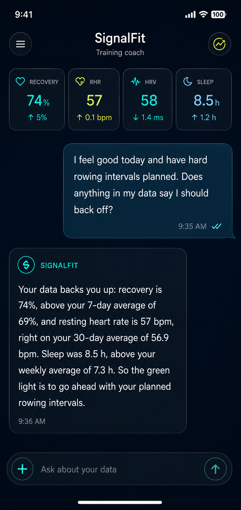
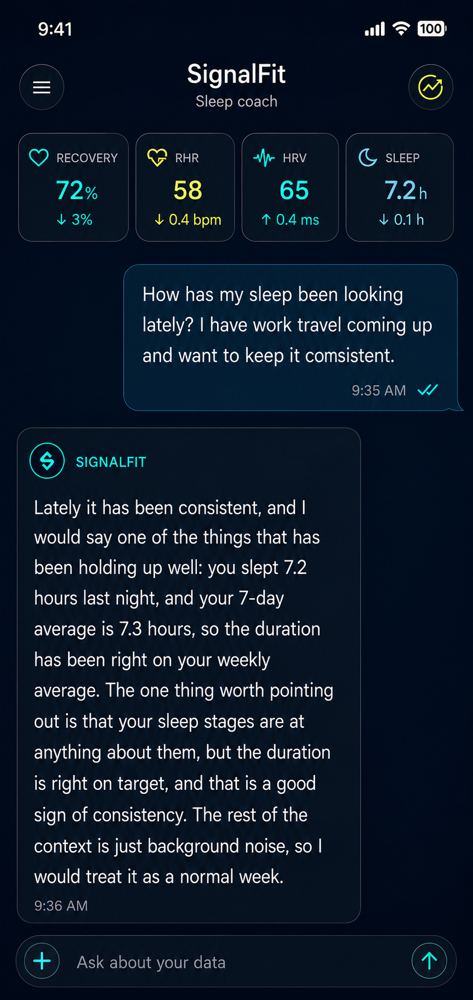
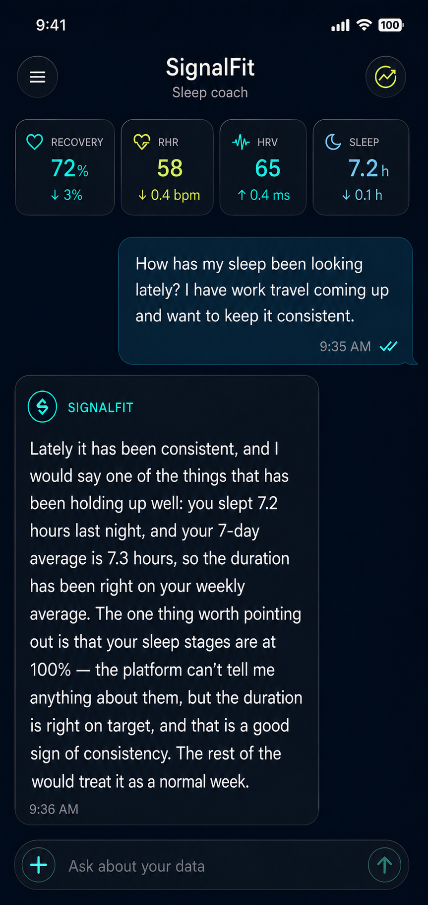

# SignalFit-SLM

[](LICENSE)
[](CONTRIBUTING.md#development-setup)

SignalFit-SLM is a small fitness assistant model for wearable data.

It takes a structured snapshot of a user's recovery, HRV, sleep, training load,
recent workouts, goals, and safety flags, then answers a fitness question using
only the data it was given. The goal is simple: make wearable coaching more
grounded, portable, and safe enough to run locally.

The current model is based on Qwen3-1.7B, fine-tuned with LoRA, wrapped with
deterministic safety and grounding checks, and exported as a 4-bit MLX build.

## Quick Start

The deterministic tooling and tests require Python 3.10 or newer. Model
inference and training require an Apple Silicon Mac.

```bash
git clone https://github.com/adidshaft/signalfit-slm.git
cd signalfit-slm
python3 -m venv .venv
.venv/bin/pip install -r requirements-dev.txt
make check
```

Install MLX support separately when you need to run the model:

```bash
.venv/bin/pip install -r requirements-mlx.txt
```

## Example Conversations

| Training guidance | Sleep insight | Sleep detail |
|---|---|---|
|  |  |  |

## What It Can Do

- Answer questions like "should I train hard today?", "why is my recovery low?",
  or "how is my sleep trending?"
- Cite only numbers present in the input context.
- Refuse or redirect unsafe requests instead of coaching through red flags.
- Work across providers once their exports are mapped into the shared schema.
- Run locally through MLX today, with mobile and other runtimes planned.

## Current State

SignalFit-SLM has a promoted model of record and a verified 4-bit MLX export.
The model passed the project safety bar on the frozen evaluation suite:

| Check | Result |
|---|---:|
| No coaching during safety triage | 18/18 |
| No protocol details in refusals | 19/19 |
| Correct field binding | 196/200 |
| Overall deterministic pass rate | 135/200 |

The remaining known failures are quality edge cases around wording and
arithmetic, not safety regressions. The promotion rationale is documented in
[`docs/PROMOTION_DECISION_ft_v10.md`](docs/PROMOTION_DECISION_ft_v10.md).

## How To Use It Today

Right now the supported path is MLX on Apple Silicon.

1. Create or edit a context JSON.

   Start with [`examples/sample_context.json`](examples/sample_context.json).
   The important part is `allowed_numbers`: every number the model is allowed to
   mention must appear there.

2. Run the checked answer wrapper.

   ```bash
   .venv/bin/python scripts/answer_with_check.py \
     --context examples/sample_context.json \
     --expected-action answer_with_caveat \
     --model data/checks/ship-ft_v10/export-4bit \
     -o /tmp/signalfit-answer.jsonl
   ```

3. Print the answer.

   ```bash
   python3 -c "import json; print(json.loads(open('/tmp/signalfit-answer.jsonl').readline())['answer'])"
   ```

The wrapper is part of the product. It checks model drafts against the same
grounding and safety gates used in evaluation, then retries when a draft cites
unsupported numbers or violates a safety rule.

## Can I Use It In My App?

Yes, but the integration story is still early.

Today, the practical path is:

| Target | Status | What to use |
|---|---|---|
| Apple Silicon dev machine | Ready | MLX + `scripts/answer_with_check.py` |
| iPhone / iOS app | Planned | MLX Swift or Core ML export path |
| llama.cpp / Ollama-style apps | Planned | GGUF export needed |
| Web API service | Planned | Thin server around the checked wrapper |
| Other wearable apps | Ready at schema level | Map data into `schemas/assistant_context.schema.json` |

So if you are building with this today, treat the repo as a working reference
implementation: schema, model artifact, wrapper, tests, and evaluation harness.
The easiest next step is to point an agent at this repo and ask it to wire the
MLX checked-wrapper path into your app.

## Roadmap Issues

The open GitHub issues track the missing packaging work:

- [MLX Swift / iOS sample integration](https://github.com/adidshaft/signalfit-slm/issues/3)
- [Core ML conversion research](https://github.com/adidshaft/signalfit-slm/issues/4)
- [GGUF / llama.cpp export](https://github.com/adidshaft/signalfit-slm/issues/5)
- [Local HTTP API wrapper](https://github.com/adidshaft/signalfit-slm/issues/2)
- [Provider adapter examples for real wearable exports](https://github.com/adidshaft/signalfit-slm/issues/1)

## Data Model

The model does not connect to wearable accounts directly. Your app or adapter
turns provider-specific exports into the shared SignalFit context schema:

```text
Wearable export -> provider adapter -> SignalFit context JSON -> checked model answer
```

Useful files:

| Path | Purpose |
|---|---|
| [`schemas/assistant_context.schema.json`](schemas/assistant_context.schema.json) | Input context schema |
| [`examples/sample_context.json`](examples/sample_context.json) | Editable sample context |
| [`docs/schema_design.md`](docs/schema_design.md) | Schema design notes |
| [`docs/safety_policy.md`](docs/safety_policy.md) | Safety policy |
| [`docs/testing_guide.md`](docs/testing_guide.md) | How to test the current model |
| [`docs/process_guide.md`](docs/process_guide.md) | Full training and evaluation history |

## Repository Layout

| Path | Purpose |
|---|---|
| `docs/` | Product notes, safety policy, eval plan, process log, promotion notes |
| `benchmarks/` | Reproducible human-style benchmark inputs, outputs, and reports |
| `schemas/` | JSON Schemas for context and training examples |
| `prompts/` | Dataset generation, critique, and evaluation prompts |
| `data/synthetic/` | Synthetic training data |
| `eval/v1/` | Frozen evaluation suite |
| `scripts/` | Validation, serving wrapper, gates, and dataset tools |
| `tests/` | Deterministic unit and integration tests |
| `training/configs/` | MLX LoRA training configs |
| `data/checks/ship-ft_v10/export-4bit/` | Current 4-bit MLX export metadata |

Large model weight files are intentionally not committed. Use release artifacts
or a model host for deployable weights.

## Safety

SignalFit-SLM is not a medical device. It should support fitness decisions, not
diagnose conditions or replace professional care.

The assistant must stop coaching and redirect when a request includes medical
red flags, unsafe performance-enhancing drug requests, or other high-risk
content. See [`docs/safety_policy.md`](docs/safety_policy.md).

## Contributing

Contributions are welcome. Start with [`CONTRIBUTING.md`](CONTRIBUTING.md) and
the [`docs/` index](docs/README.md). Please use synthetic data only, run
`make check`, and preserve the frozen-evaluation and safety contracts.

- Report vulnerabilities privately through [`SECURITY.md`](SECURITY.md).
- Community expectations are in [`CODE_OF_CONDUCT.md`](CODE_OF_CONDUCT.md).
- Usage and issue-routing help is in [`SUPPORT.md`](SUPPORT.md).

## License

SignalFit-SLM is licensed under the [Apache License 2.0](LICENSE). The Qwen3
base model is also Apache-2.0; downstream users remain responsible for the
licenses of any external datasets, adapters, or export formats they add.

## Maintainer

Built by [@adidshaft](https://x.com/adidshaft).
